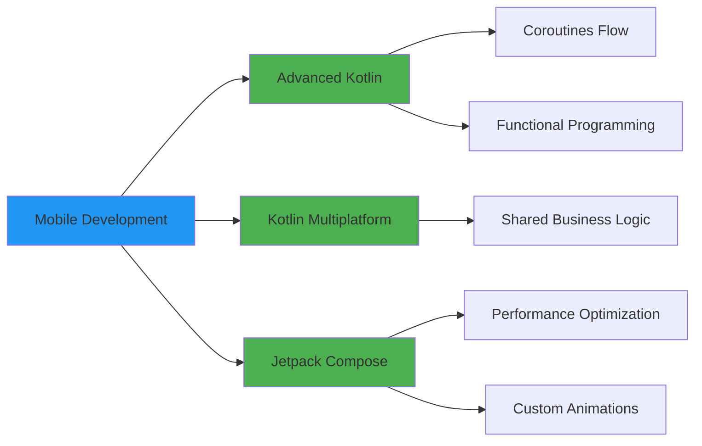

<div align="center">

<!-- Elegant Header -->


<!-- Professional Introduction -->
<h1>
  
</h1>

[](https://gamalaldin-i.github.io/G-Portfolio/)
[](https://linkedin.com/in/gamal-hataba-84a296240)
[](mailto:htbtjmal2013@gmail.com)
[](https://wa.me/201117559874)


</div>

---

## 💼 Professional Summary


```kotlin
class GamalaldinIbrahim : MobileDeveloper() {
    
    val profile = DeveloperProfile(
        role = "Android Developer",
        experience = "2+ Years",
        location = "Al Mansurah, Egypt 🇪🇬",
        availability = "Open to opportunities",
        
        expertise = listOf(
            "Native Android Development",
            "Cross-Platform Solutions",
            "System Architecture Design",
            "Performance Optimization",
            "Team Leadership & Mentoring"
        ),
        
        approach = DevelopmentApproach(
            codeQuality = "Test-Driven Development",
            architecture = "Clean & Scalable",
            userFocus = "Performance & Accessibility",
            collaboration = "Agile Methodologies"
        )
    )
    
    override fun collaborate() = """
        I believe in building products that users love
        and code that developers enjoy maintaining.
        Let's create something extraordinary together!
    """
}
```

<br>

### 🎯 What I Bring to Your Team

<table>
<tr>
<td width="50%">

#### 🚀 Technical Excellence
- **Production-Ready Code**: Writing maintainable, scalable code following industry best practices
- **Modern Architecture**: MVVM, MVI, Clean Architecture with Repository Pattern
- **Performance-Focused**: Profiling, optimization, and memory management
- **Testing Culture**: Unit, Integration, and UI testing (JUnit, Espresso, Mockito)

</td>
<td width="50%">

#### 💡 Business Value
- **User-Centric Development**: Creating intuitive experiences that drive engagement
- **Cross-Functional Collaboration**: Working seamlessly with designers, PMs, and stakeholders
- **Problem Solver**: Analyzing requirements and delivering optimal solutions
- **Continuous Learning**: Staying current with latest Android and mobile trends

</td>
</tr>
</table>

---

## 🛠️ Technology Stack

<div align="center">

### Core Mobile Development

<table>
<tr>
<td align="center" width="96">

<br>Kotlin
</td>
<td align="center" width="96">

<br>Java
</td>
<td align="center" width="96">

<br>Dart
</td>
<td align="center" width="96">

<br>Flutter
</td>
<td align="center" width="96">

<br>Android Studio
</td>
</tr>
</table>

### Backend & Database

<table>
<tr>
<td align="center" width="96">

<br>Firebase
</td>
<td align="center" width="96">

<br>Supabase
</td>
<td align="center" width="96">

<br>SQLite/Room
</td>
<td align="center" width="96">

<br>Postman
</td>
</tr>
</table>

### Tools & DevOps

<table>
<tr>
<td align="center" width="96">

<br>Git
</td>
<td align="center" width="96">

<br>Gradle
</td>
<td align="center" width="96">

<br>Figma
</td>
<td align="center" width="96">

<br>VS Code
</td>
<td align="center" width="96">

<br>Linux
</td>
</tr>
</table>

### Additional Skills

<table>
<tr>
<td align="center" width="96">

<br>Python
</td>
<td align="center" width="96">

<br>C++
</td>
<td align="center" width="96">

<br>HTML
</td>
<td align="center" width="96">

<br>CSS
</td>
<td align="center" width="96">

<br>REST API
</td>
</tr>
</table>

</div>

---

## 📊 GitHub Analytics

<div align="center">


</div>

---

## 🏆 Achievements & Recognition

<div align="center">


</div>

---

## 📚 Technical Expertise Deep Dive

<details>
<summary><b>🏗️ Architecture & Design Patterns</b></summary>
<br>

- ✅ **MVVM (Model-View-ViewModel)** - Primary architecture for Android apps
- ✅ **MVI (Model-View-Intent)** - For complex state management
- ✅ **Clean Architecture** - Separation of concerns with domain, data, and presentation layers
- ✅ **Repository Pattern** - Data abstraction and single source of truth
- ✅ **Dependency Injection** - Hilt/Dagger for scalable, testable code
- ✅ **Observer Pattern** - LiveData, StateFlow for reactive programming

</details>

<details>
<summary><b>📱 Android Jetpack Components</b></summary>
<br>

| Component | Expertise Level | Use Cases |
|-----------|----------------|-----------|
| **Room** | ⭐⭐⭐⭐⭐ | Local database, caching, offline-first |
| **WorkManager** | ⭐⭐⭐⭐⭐ | Background tasks, data sync |
| **Navigation** | ⭐⭐⭐⭐⭐ | Single-activity architecture |
| **ViewModel** | ⭐⭐⭐⭐⭐ | Lifecycle-aware state management |
| **LiveData/Flow** | ⭐⭐⭐⭐⭐ | Reactive data streams |
| **Paging 3** | ⭐⭐⭐⭐ | Efficient large dataset loading |
| **DataStore** | ⭐⭐⭐⭐ | Modern preferences storage |

</details>

<details>
<summary><b>🎨 UI/UX Development</b></summary>
<br>

- ✅ **Jetpack Compose** - Modern declarative UI toolkit
- ✅ **Material Design 3** - Latest design system implementation
- ✅ **Custom Views** - Creating reusable, performant components
- ✅ **Animations** - Motion Layout, Property Animation, Compose animations
- ✅ **Accessibility** - WCAG compliance, TalkBack support
- ✅ **Responsive Design** - Supporting all screen sizes and orientations

</details>

<details>
<summary><b>⚡ Performance Optimization</b></summary>
<br>

- ✅ **Memory Management** - LeakCanary, memory profiling, bitmap optimization
- ✅ **Network Optimization** - Retrofit, OkHttp, caching strategies
- ✅ **Database Optimization** - Indexing, query optimization, background operations
- ✅ **App Startup** - Lazy initialization, App Startup library
- ✅ **Build Performance** - Gradle optimization, build cache configuration
- ✅ **APK Size** - ProGuard/R8, resource optimization

</details>

<details>
<summary><b>🧪 Testing & Quality Assurance</b></summary>
<br>

```kotlin
// Unit Testing
✓ JUnit 5 for business logic testing
✓ MockK/Mockito for mocking dependencies
✓ Truth for readable assertions

// Integration Testing
✓ Room database testing
✓ Repository testing with fake data sources

// UI Testing
✓ Espresso for Android UI testing
✓ Compose UI Testing
✓ Screenshot testing

// Code Quality
✓ Ktlint for code formatting
✓ Detekt for static analysis
✓ SonarQube integration
✓ Code coverage > 80%
```

</details>

---

## 🎯 Current Focus & Learning



---

## 📫 Let's Build Something Amazing Together

<div align="center">

### 💼 Available for:
- 🚀 Full-time positions
- 💡 Freelance projects
- 🤝 Technical consultations
- 👥 Mentorship opportunities
- 📝 Code reviews

<br>

<table>
<tr>
<td align="center">
<a href="mailto:htbtjmal2013@gmail.com">

</a>
</td>
<td align="center">
<a href="https://linkedin.com/in/gamal-hataba-84a296240">

</a>
</td>
<td align="center">
<a href="https://github.com/Gamalaldin-I">

</a>
</td>
<td align="center">
<a href="https://wa.me/201234567890">

</a>
</td>
</tr>
</table>

<br>

### 📍 Location: Al Mansurah, Egypt 🇪🇬
### 🌍 Open to: Remote • Hybrid • Relocation

<br>

> *"Code is like humor. When you have to explain it, it's bad."* – Cory House

<br>

**⚡ Fun Fact:** I've optimized app startup time by 60% and reduced crashes by 85% in production apps serving 100K+ users

</div>

---

<div align="center">

### 🌟 If you find my work valuable, consider:

[](https://github.com/Gamalaldin-I)
[](https://github.com/Gamalaldin-I)

</div>

<!-- Snake Animation -->
<picture>
  <source media="(prefers-color-scheme: dark)" srcset="https://raw.githubusercontent.com/platane/snk/output/github-contribution-grid-snake-dark.svg">
  <source media="(prefers-color-scheme: light)" srcset="https://raw.githubusercontent.com/platane/snk/output/github-contribution-grid-snake.svg">
  
</picture>


